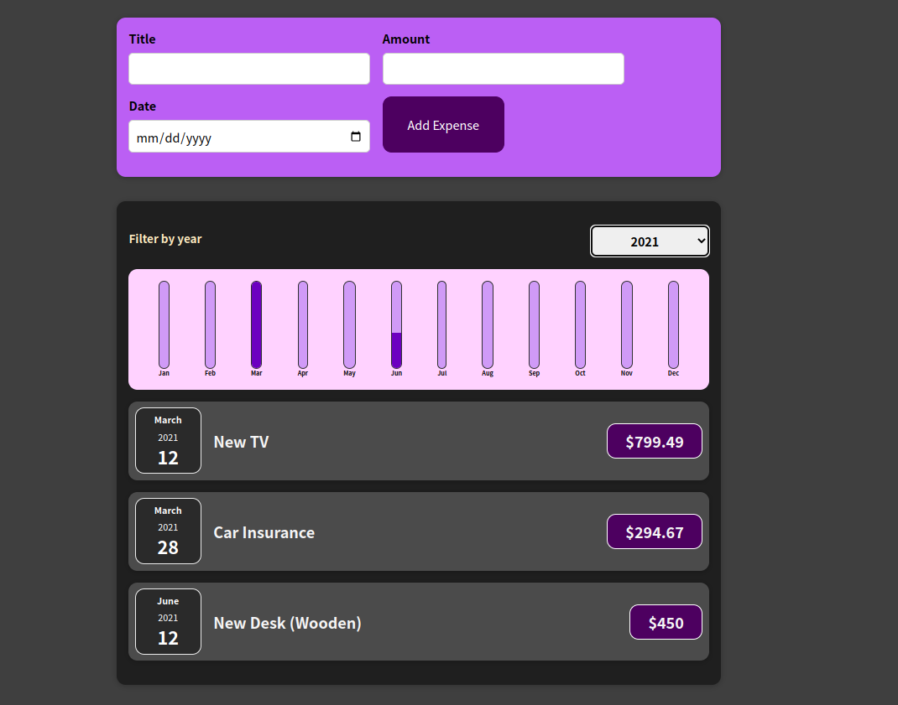

# Expense Tracker

> This app is for tracking your expense on daily life. user can input name of item, amount of the item and date of the expense, they can track by filter by year. other feature of the app is it give you monthly chart Bar of your expenese. If you like it do not forget to give me star.

## ScreenShot

</img>
## Built With

- HTML & Css
- React

## Live Demo (if available)
 [on progress...]

## Getting Started
- Make sure you have node installed on your local machine.

step 1: Clone this repo locally using git in the command line and the following command

git clone (https://github.com/aron-helu/Expenese-Tracker.git)

Step 2: run npm install to download the necessary modules.

step 3: run npm start to load the project.

### Prerequisites

Any html and css code editor like Vscode or Vim.

## Authors

👤 **Aaron Abraham**

- GitHub: [@Aaron](https://github.com/aron-helu)

- LinkedIn: [@Aaron](https://www.linkedin.com/in/aron-abraham-90a4321b0/)

## 🤝 Contributing

Contributions, issues, and feature requests are welcome!

Feel free to check the [issues page](../../issues/).

## Show your support

Give a ⭐️ if you like this project!

## Acknowledgments

## 📝 License

This project is [MIT](./MIT.md) licensed.
